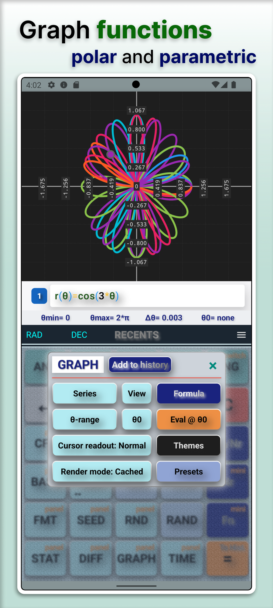
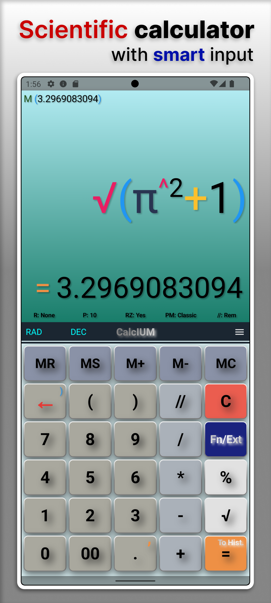
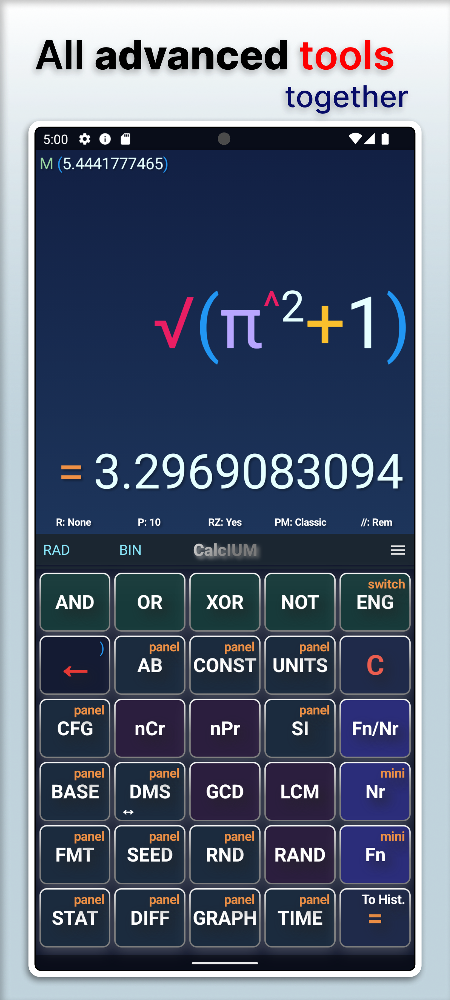

# CalcIUM — Scientific Calculator

Fast, structured and precise scientific calculator for Android.

---

## 📱 Overview

CalcIUM is a scientific calculator focused on:
- high precision (BigDecimal)
- structured workflow
- advanced graphing

Designed to be both powerful and pleasant to use.

---

## 🔥 Features

- Function, parametric and polar graphs  
- Multiple graph series  
- Graph presets (ready to use)  
- Unit converter  
- Time calculations  
- Extended math tools (constants, bases, statistics, etc.)

---

## 🎥 Preview

• Graph presets (Short)  
https://youtube.com/shorts/qW3mBljvFIo  

• Quick conversions (Units)  
https://youtube.com/shorts/pr1Vn9dIKno  

---

## 📷 Screenshots

---

## 📦 Download

Google Play:  
https://play.google.com/store/apps/details?id=com.liubomyr.calcium

---

## ⚙️ Precision

All calculations use **BigDecimal** instead of double precision.

This ensures consistent and predictable results across the entire application.

---

## 🧠 About the project

CalcIUM started as a small learning project and gradually evolved into a full-featured scientific calculator.

The goal was to build something precise, structured and actually enjoyable to use.

---

## 🚀 Status

Active development.

---

## 👤 Author

Created and developed by **Liubomyr Yakob**
